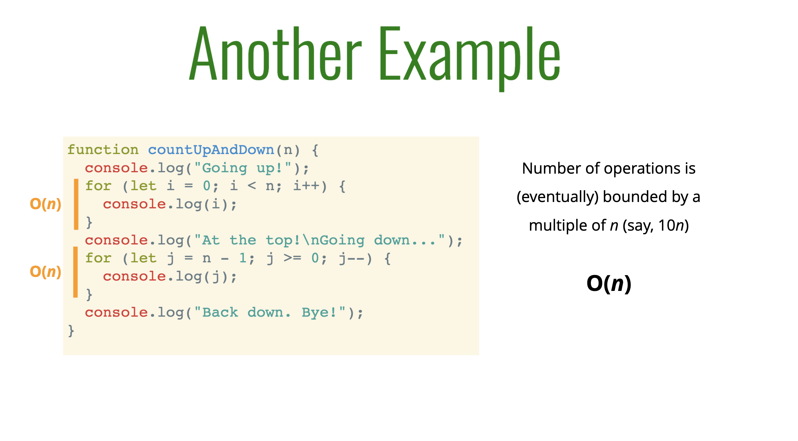
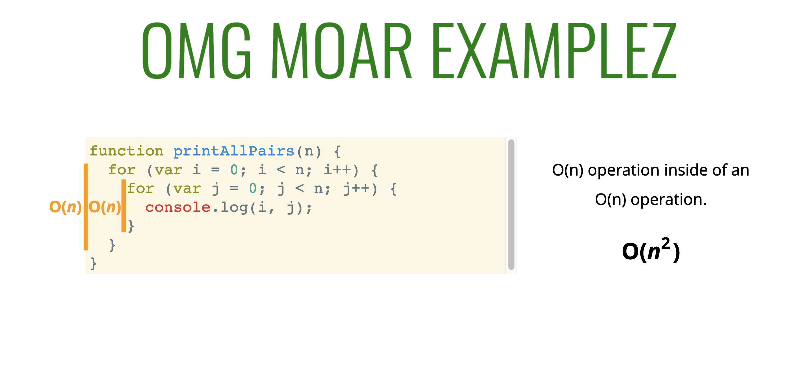
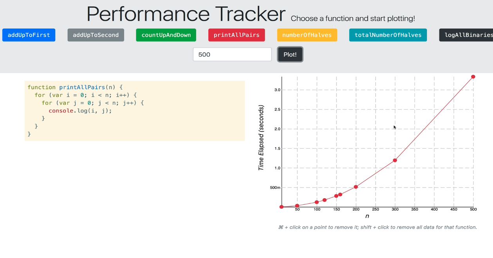
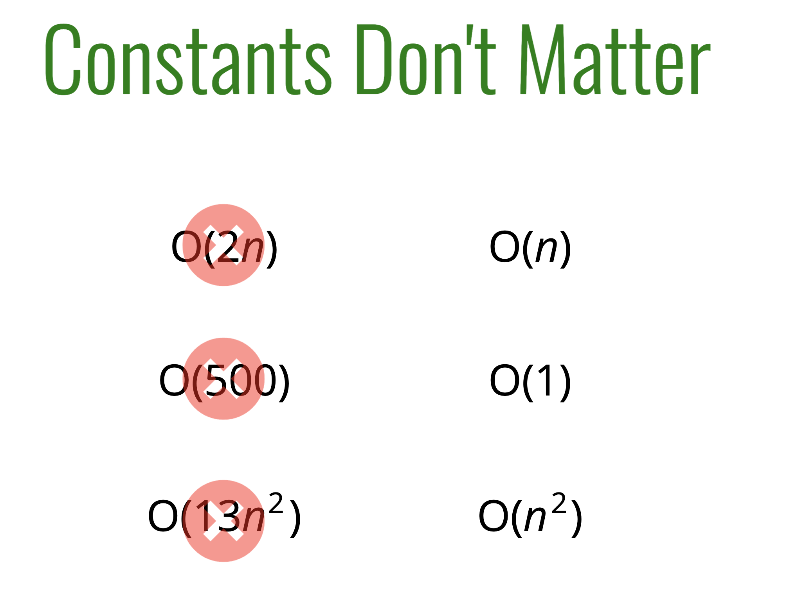
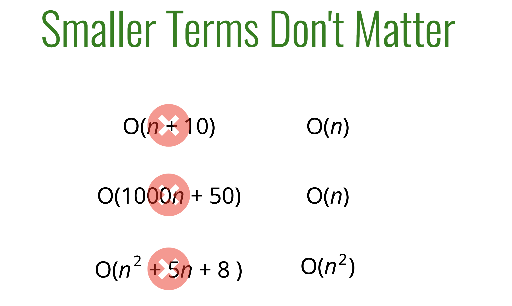
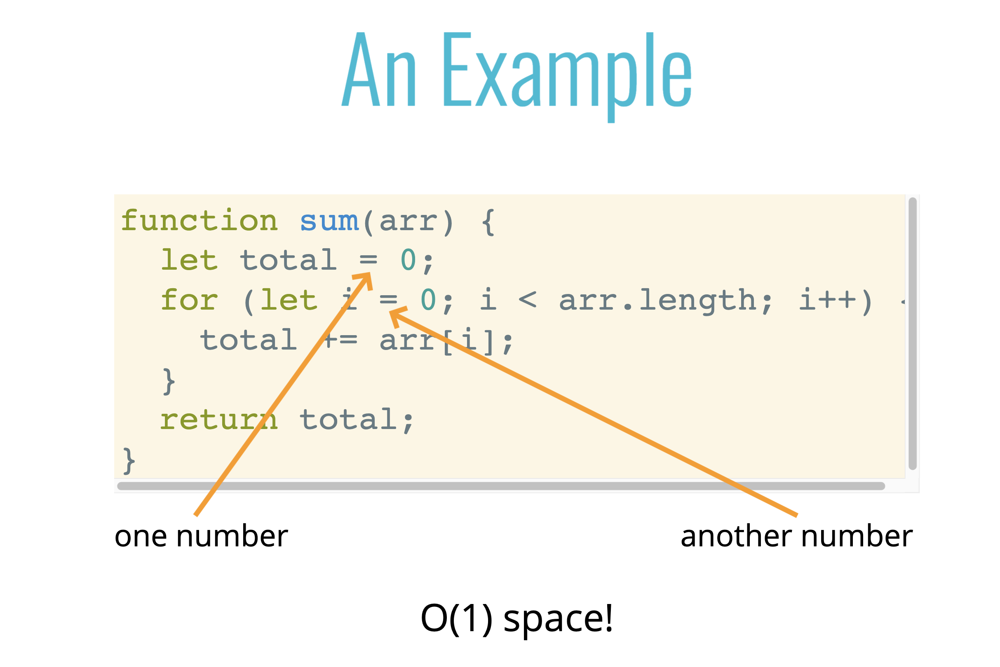
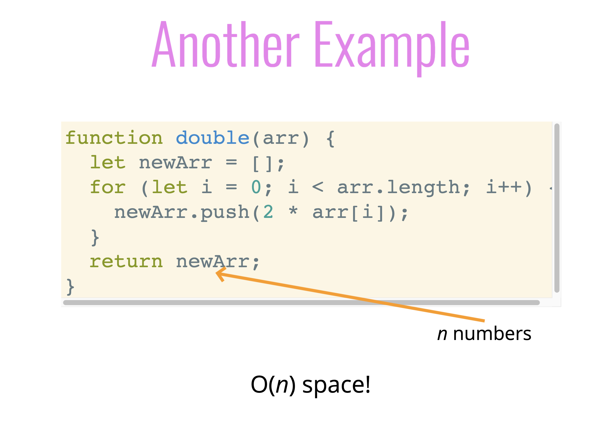
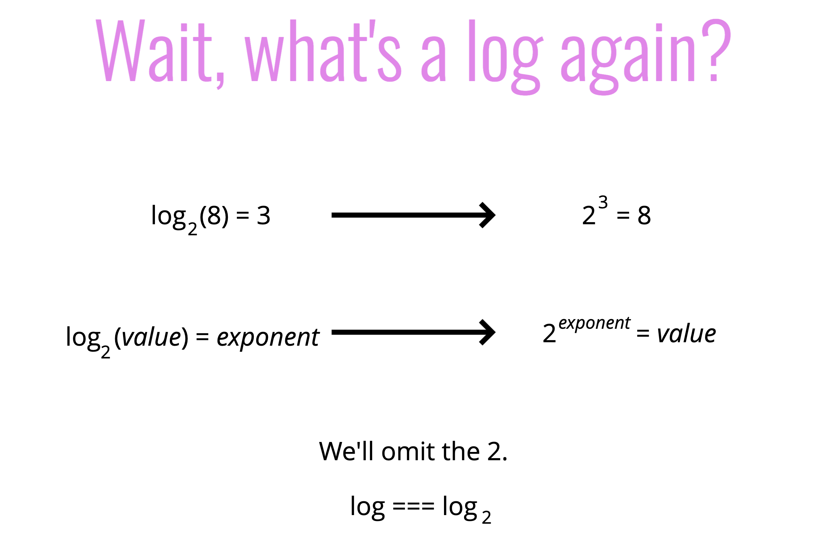

# Big O Notation

**Objectives**:

1. 빅오 표기법의 필요성을 설명
2. 빅오 표기법이란 무엇인지 설명
3. 빅오 표기법 식을 단순화
4. "time complexity(시간 복잡도)"와 "space complexity(공간 복잡도)"를 정의
5. 빅오 표기법을 사용하여 다양한 알고리즘의 "time complexity"와 "space complexity"를 평가
6. 로그함수가 무엇인지 설명

## 1. 빅오 표기법이란?

빅 오 표기법은 **알고리즘의 성능을 나타내는 방법**으로, 입력 크기에 따른 알고리즘의 실행 시간이나 메모리 사용량을 간략하게 표현합니다. 컴퓨터 과학에서 사용되는 이 표기법은 알고리즘 간의 비교를 용이하게 하며, 최악, 평균 또는 최선의 경우 시나리오를 설명할 수 있습니다.

빅 오 표기법은 다음과 같은 형태를 가집니다: **_O(f(n))_**, 여기서 **_n은 입력 크기_**를 나타내며, **_f(n)은 연산 수_**를 나타냅니다. 이 표기법은 **알고리즘의 실행 시간이 n에 따라 어떻게 증가하는지를 대략적으로 표시**합니다.

빅 오 표기법의 몇 가지 예시입니다:

- **O(1): 상수 시간 복잡도를 가진 알고리즘으로, 입력 크기와 무관하게 일정한 시간이 걸린다.**
- **O(n): 선형 시간 복잡도를 가진 알고리즘으로, 입력 크기에 비례하여 시간이 증가한다.**
- **O(n^2): 이차 시간 복잡도를 가진 알고리즘이며, 입력 크기의 제곱에 비례하여 시간이 증가한다.**
- **O(log n): 로그 시간 복잡도를 가진 알고리즘으로, 입력 크기가 커짐에 따라 시간이 로그 함수처럼 증가한다.**

이처럼 빅 오 표기법은 **알고리즘의 복잡도를 효과적으로 비교하고 분석**하는 데 도움이 됩니다.

## 빅오 표기법의 필요성

문제를 해결하는 여러 가지 방법이 있습니다. 또한 동일한 해결책에 대해 다른 구현 방법을 가질 수도 있습니다. 이때 어떤 알고리즘이 가장 효율적인지 또는 최상의 알고리즘이 무엇인지 어떻게 알 수 있을까요?

**우리는 빅오 표기법을 사용하여 알고리즘을 비교할 수 있습니다.**

**빅오 표기법:** 알고리즘의 효율성을 측정하는 데 사용됩니다. 어떤 기계에서 실행되는지와 상관없이 알고리즘을 비교하고 이야기할 수 있는 방법을 제공합니다. 알고리즘의 최악의 경우를 고려합니다. 이것은 우리의 코드를 일반화하여 알 수 있도록 합니다.

**Example:** 문자열 입력을 받아 반전된 복사본을 반환하는 함수를 작성합니다.

**이를 수행하는 다양한 방법이 있습니다.**

1. [Stack Overflow answers](https://stackoverflow.com/questions/958908/how-do-you-reverse-a-string-in-place-in-javascript)
2. [Analysis of ten ways to solve this](https://eddmann.com/posts/ten-ways-to-reverse-a-string-in-javascript/).

이를 해결하는 다양한 방법의 분석 빅오 표기법은 일반화된 라벨을 사용하여 코드의 효율성을 분류하는 시스템으로 볼 수 있습니다.


<br/>
우리는 빅 오 표기법을 사용하여 알고리즘을 비교할 수 있습니다.

색상이나 단어 대신에 우리는 코드를 측정하는 수치적인 표현을 가질 수 있습니다.

효율성에 대해 왜 신경 써야 할까요? 효율성은 코드가 완료되는 데 걸리는 시간의 차이를 의미할 수 있습니다.

만약 Google 검색이 최적화되지 않았다면 각각의 검색어 처리에 몇 분이 걸린다면, 그 서비스를 사용하는 빈도가 훨씬 적을 것입니다.

비즈니스 관점에서, 이는 비용과 시간을 절약하고 경쟁 우위를 가지는 것을 의미합니다.

빅 오 표기법이 어떻게 유용한가요?

- 코드의 성능을 이야기할 때 정확한 어휘를 갖는 것이 중요합니다.
- 다양한 접근 방식 사이의 트레이드 오프를 논의하는 데 유용합니다.
- 코드가 느려지거나 충돌이 발생할 때 비효율적인 코드를 식별하면 문제를 해결할 수 있는 곳을 찾을 수 있습니다.


**트레이드 오프(Trade-off)** 란 어떤 상황에서 두 가지 이상의 대상이나 목표 사이에 서로 양보하거나 균형을 맞추는 것을 의미합니다. 즉, 한 쪽을 강화하면 다른 쪽이 약화될 수 있는 상황을 말합니다.

컴퓨터 과학 및 소프트웨어 개발 분야에서 트레이드 오프는 다양한 측면에서의 선택 사항 간의 균형을 찾는 것을 의미합니다. 이는 주로 다음과 같은 상황에서 나타납니다:

1. **시간 대 비용:** 어떤 알고리즘이나 방법을 선택할 때, 실행 시간을 줄이기 위해 더 복잡한 알고리즘을 사용하면 그에 따른 추가적인 리소스나 비용이 들 수 있습니다.
2. **메모리 대 시간:** 데이터를 더 효율적으로 저장하려면 추가적인 메모리를 사용해야 할 수 있습니다. 이는 작업 시간과 메모리 사용량 간의 균형을 맞추는 것을 의미합니다.
3. **유지 보수 대 생산성:** 코드를 더 모듈화하고 가독성 있게 작성하면 유지 보수가 용이해지지만 개발 초기 단계에서 더 많은 시간이 들 수 있습니다.
4. **복잡성 대 단순함:** 더 복잡한 방법을 사용하면 더 많은 기능을 구현할 수 있지만 코드가 더 복잡해지고 이해하기 어려워질 수 있습니다.
5. **선형성 대 정확성:** 근사 알고리즘을 사용하면 계산이 빠르지만 결과의 정확도가 떨어질 수 있습니다.

이러한 트레이드 오프를 논의할 때, 빅 오 표기법을 사용하여 각 접근 방식의 성능을 비교하고 분석함으로써 어떤 접근 방식이 가장 적절한지 결정할 수 있습니다.

</aside>

## 빅오 표기법 예시

1부터 n까지(포함)의 모든 수의 합을 계산하는 함수를 작성하세요.

Most common solution:

```
// naive solution
function addUpToNaive(n) {
  let total = 0;  // accumulator
  for (let i = 1; i <= n; i++) {
    total += i;  // loop over
  }
  return total;
}

// more optimized solution
function addUpToOptimized(n) {
  return n * (n + 1) / 2;
}
```


<br/>
더 나은 덧셈 알고리즘인 addUpToOptimized()의 증명은 덜 직관적이고 수학적입니다. 루프가 없지만 이 알고리즘이 동작하는 것을 증명하는 근거가 있습니다. 루프가 없기 때문에 기본적인 해결책보다 더 빠르고 효율적입니다.

**"더 나은"이란 무엇을 의미하나요?**

1. 빠른가요?
2. 덜 메모리를 소비하나요?
3. 더 가독성이 좋나요?
   이는 상황에 따라 다릅니다. 대부분의 사람들은 속도와 메모리 사용량이 가장 중요하다고 생각할 것입니다.

보통 처음 두 가지 요소가 가독성을 희생합니다. 하지만 코드와 문서에 주석을 추가하여 명확하게 설명할 수 있습니다.

첫 번째 초점은 속도를 평가하는 데에 둘 것입니다.

**Evaluating Speed**

```
// naive solution
function addUpToNaive(n) {
  let total = 0;  // accumulator
  for (let i = 1; i <= n; i++) {
    total += i;  // loop over
  }
  return total;
}

// more optimized solution
function addUpToOptimized(n) {
  return n * (n + 1) / 2;
}

// Using a timer a naive way to test efficiency of code
// if in browser
let t1 = perfromance.now();
addUpTo(100000000);
let t2 = performance.now()
console.log(`Time elapse: ${(t2 - t1) / 1000}seconds`);

// if in NodeJS
const ONE_BILLION = 1000000000;

// naive solution
let t1 = process.hrtime.bigint();  // returns nanoseconds
addUpToNaive(100000000);
let t2 = process.hrtime.bigint();
console.log(`Naive Time elapse: ${parseInt(t2 - t1) / ONE_BILLION } seconds`);

// optimized solution
let t3 = process.hrtime.bigint();
addUpToOptimized(100000000);
let t4 = process.hrtime.bigint();
console.log(`Optimized Time elapse: ${parseInt(t4 - t3) / ONE_BILLION }seconds`);
```

최적화된 버전의 실행 시간은 기본적인 해결책보다 현저하게 짧습니다. 이는 시간, 비용 및 계산량을 절약하는 것을 의미합니다.

그러나 수동으로 시간을 측정하는 과정은 신뢰할 수 없습니다. 실행 시의 변동성이 있을 수 있으며, 어떤 컴퓨터는 다른 컴퓨터보다 더 빠를 수 있습니다. 이로써 우리는 정밀도에 대한 잘못된 인식을 가질 수 있습니다.

## 시간에 대한 문제점

1. 다른 기기에서는 다른 시간이 기록됩니다.
2. 같은 기기에서도 다른 시간이 기록됩니다.
3. 빠른 알고리즘의 경우 속도 측정은 충분히 정확하지 않을 수 있습니다. 개선 사항의 차이를 비교하기가 어렵습니다.

**코드의 실행 시간을 측정하는 것은 유용하지만, 알고리즘을 비교하는 가장 효과적인 방법은 아닙니다.**

코드 실행이 몇 시간이 걸린다면 어떨까요? 일반적인 용어로 코드를 이야기할 수 있는 더 효과적인 방법이 필요합니다. 그래서 우리는 빅 오 표기법을 사용합니다.

## 시간이 아니라면 무엇을 사용해야 할까요?

❌ 하지 말아야 할 점 - 기계 내부 및 기기 간에 가변적인 초 단위 계산을 세지 마세요.

⭕️ 해야 할 점 - 컴퓨터가 수행해야 하는 간단한 연산의 수를 세세요. 이는 컴퓨터 사양과 상관없이 일정합니다.

## Counting Operations(연산 횟수 세기)

적은 연산 횟수는 빠른 알고리즘을 의미합니다.


<br/>
n이 10억이건 10이건 상관없이 발생하는 연산은 오직 세 가지뿐입니다.

연산 횟수가 많을수록 느린 알고리즘을 의미합니다.


<br/>
루프를 사용하면 연산이 n 번 수행됩니다.

만약 우리가 연산의 양이 변수인 n을 다루어야 할 때는 어떻게 세어야 할까요?

**Key Idea:** 우리는 모든 단계를 정확하게 계산하는 것에 신경 쓰지 않습니다.

우리는 큰 그림에 초점을 맞춥니다.

알고리즘이 어떻게 성장하고 확장되는지에 관심을 둡니다.

우리의 기본적인 해결책의 경우, n이 커짐에 따라 연산의 수도 대략적으로 선형적으로 증가합니다.

## Performance tracker


<br/>
입력의 수가 증가함에 따라 실행 시간이 거의 일정한 시간으로 확장되는 것을 관찰하세요. 즉, 실행 시간이 실제로 크게 변하지 않습니다. 이것이 가장 우수한 유형의 알고리즘입니다. [성능 추적기를 확인하여 일부 알고리즘의 확장성을 시각적으로 확인하세요.](https://rithmschool.github.io/function-timer-demo/)

## 빅 오 표기법

**빅 오 표기법을 정의하는 몇 가지 방법:**

1. 흐릿한 계산을 형식화하는 방법.

2. 입력의 변화와 알고리즘의 실행 시간 간의 관계를 설명하는 방법.

3. 알고리즘의 실행 시간이 입력이 증가함에 따라 어떻게 성장하는지 형식적으로 이야기할 수 있는 방법.

4. 만약 컴퓨터가 수행하는 간단한 연산의 수가 결국 상수배로 f(n)보다 작아진다면, 알고리즘은 O(f(n))입니다. 여기서 n이 증가합니다. 최악의 경우 시나리오, 즉 알고리즘의 실행 시간 상한선이 사용됩니다.

## 함수가 확장되는 다양한 방식

1. 상수: f(n) = 1 입력 값이 증가해도 실행 시간은 대략 동일하게 유지됩니다. 대체로 최선의 경우입니다.
2. 선형: f(n) = n 입력 값이 n만큼 증가하면 실행 시간도 n만큼 증가합니다.
3. 이차: f(n) = n^2 입력 값이 n만큼 증가하면 실행 시간은 n의 제곱만큼 증가합니다. 따라서 매우 빠르게 커집니다. 최선의 해결책은 아닙니다.
4. f(n) - ???: 완전히 다른 형태일 수도 있습니다 ¯\(ツ)/¯ ????

**빅 오 표기법을 기억하는 좋은 방법:** n이 증가할 때 알고리즘이 어떻게 따라서 증가하는지 이해합니다.

## 빅 오 표기법이 적용된 알고리즘 예시

- 최적화된 addUpTo 함수

```
function addUpToOptimized(n) {
  return n * (n + 1) / 2;
}
```

대략 3개의 단순한 연산이 이루어집니다. O(1)

- 비효율적인 addUpTo 함수

```
function addUpToNaive(n) {
  let total = 0;  // accumulator
  for (let i = 1; i <= n; i++) {
    total += i;  // loop over
  }
  return total;
}
```

연산 수는 결국 n의 배수 (예: 10n)로 제한됩니다. O(n) 우리는 세세한 상황보다는 일반적인 추세에만 관심이 있습니다. 따라서 10n이든 100n이든 중요하지 않습니다. 왜냐하면 궁극적으로 이것을 그냥 n이라고 단순화할 수 있기떄문입니다.

## Another example


<br/>

```javascript
function countUpAndDown(n) {
  console.log("Going up!");
  // O(n)
  for (let i = 0; i < n; i++) {
    console.log(i);
  }
  console.log("At the top!\n Going down...");
  // O(n)
  for (let j = n - 1; j >= 0; j--) {
    console.log(j);
  }
  console.log("Back down. Bye!");
}
```

O(n) + O(n) = O(2n) 우리는 전체적인 상황에만 관심이 있기 때문에, 이를 O(n)으로 일반화합니다.


<br/>

```
// will print all the pairs from 0 to n
// 0 1, ... 1,0 ... n,n
function printAllPairs(n) {
  // O(n)
  for (var i = 0; i < n; i++) {
    // for every n in O(n), O(n)
    // O(n) * O(n) = O(n * n) = O(n^2)
    for (var j = 0; j < n; j++) {
      console.log(i, j);
    }
  }
}
```



O(n) 연산 내에 있는 O(n) 연산입니다. 중첩 루프라고 합니다. 루프가 중첩되어 있기 때문에 n이 증가하면 n 내부의 n 수도 증가합니다. 그래서 이것은 지수적으로 증가합니다. 실행 시간은 f(n^2)입니다.

## 빅 오 표현식 단순화

알고리즘의 시간 복잡도를 결정할 때, 빅 오 표현식과 관련된 몇 가지 유용한 경험법칙들이 있습니다. 이러한 경험 법칙들은 빅 오 표기법의 정의로 인한 결과입니다. 이를 통해 빅 오 표현식을 간단하게 만들 수 있습니다.

1. 상수는 본질적으로 중요하지 않습니다.

    
   <br/>

```
 O(500) -> O(1)
 O(2n) -> O(n)
 O(13n^2) -> O(n^2)
```

2. 작은 연산들도 중요하지 않습니다.
   
   <br/>

```
 O(n + 10) -> O(n)
 O(1000n + 50) -> O(n)
 O(n^2 + 5n + 8) -> O(n^2)
```

중요한 것은 최고차항의 계수 즉, 다항식에서 가장 높은 차수의 계수입니다.

**Big O shorthands** 이러한 규칙은 항상 작동하지는 않지만, 꽤 좋은 근사치를 제공합니다.

- **산술 연산(덧셈, 뺄셈, 곱셈, 나눗셈)의 복잡도는 상수입니다.**
- **변수 할당의 복잡도는 상수입니다.**
- **배열(인덱스로) 또는 객체(키로)에 있는 요소에 접근하는 복잡도는 상수입니다.**
- **루프 내의 복잡도는 루프의 길이와 루프 내에서 발생하는 작업의 복잡도를 곱한 것입니다.**

### General Trend of algorithms


## A Couple More Examples

```
// 최소 1부터 5까지의 숫자를 출력
// n과 5 중에서 더 큰 값까지 출력

function logAtLeast5(n) {
  for (var i = 1; i <= Math.max(5, n); i++) {
    console.log(i);
  }
}

logAtLeast5(7); // 출력: 1, 2, 3, 4, 5, 6, 7
```

**Big O is O(n)** <br/>
: 왜냐하면 루프가 최소 5회에서 최대 n회 실행되며, n이 커질수록 실행 횟수가 선형적으로 증가하기 때문.

```
// 최대 5까지의 숫자를 출력
// n과 5 중에서 더 작은 값까지만 출력

function logAtMost5(n) {
  for (var i = 1; i <= Math.min(5, n); i++) {
    console.log(i);
  }
}

logAtMost5(3); // 출력: 1, 2, 3
logAtMost5(7); // 출력: 1, 2, 3, 4, 5
```

**Big O is O(1)** <br/>
:왜냐하면 루프가 최대 5회만 실행. 입력 크기와 상관없이 일정한 시간이 걸리는 알고리즘을 상수 시간 알고리즘

즉) n이 무한대로 커지는 최악의 경우 무엇이 일어나는지에 대해 알아보았습니다. <br/>
지금까지 빅 오 표기법을 시간 복잡도 측면에서 설명했습니다. <br/>
**시간 복잡도:** 입력 크기가 증가함에 따라 알고리즘의 실행 시간을 어떻게 분석할 수 있는지에 관한 개념입니다.

---

### 시간복잡도 QUIZ

아래 함수에 대한 시간 복잡도를 구하세요.

```
function onlyElementsAtEvenIndex(array) {
    var newArray = Array(Math.ceil(array.length / 2));
    for (var i = 0; i < array.length; i++) {
        if (i % 2 === 0) {
            newArray[i / 2] = array[i];
        }
    }
    return newArray;
}
```

- 배열을 생성하는데 걸리는 시간은 상수입니다. O(1)
- 주어진 배열의 길이만큼 for 루프가 반복되며, 각각의 반복에서 상수 시간이 걸리는 단순 연산을 수행합니다. (i가 짝수인지 확인하고, 해당 요소를 새로운 배열에 할당)

따라서, 본 함수의 시간 복잡도는 주어진 배열의 길이에 비례하며, 빅 오로 표현하면 O(n)이 됩니다. 여기서 n은 입력 배열의 길이입니다.

---

## 공간 복잡도

공간 복잡도는 알고리즘이 실행되는 동안 필요한 메모리 공간을 측정하는 방법입니다. <br/>
입력 크기가 증가함에 따라 알고리즘이 사용하는 메모리가 어떻게 변하는지 분석합니다. <br/>
공간 복잡도는 변수, 객체, 함수 호출 등 실행에 필요한 저장 공간의 요구사항을 포함합니다. 공간 복잡도도 시간 복잡도와 비슷하게 빅 오 표기법을 사용하여 표현합니다. 알고리즘의 성능을 평가하는 데 도움이 되며, 공간의 사용량에 따라서 알고리즘을 비교하고 더 효율적인 대안을 선택할 수 있습니다. <br/>

**공간 복잡도 예:**

1. O(1): 상수 시간 공간 복잡도를 가진 알고리즘은 입력 크기와 관계없이 일정한 양의 메모리를 사용합니다.
2. O(n): 선형 공간 복잡도를 가진 알고리즘은 입력 크기에 비례하는 양의 메모리를 사용합니다. 입력이 커지면 메모리 사용량도 선형적으로 증가합니다.

공간 복잡도 분석을 할 때 보조 공간 복잡도라는 용어가 사용될 수 있는데, 이는 알고리즘이 필요로 하는 추가 공간을 의미하며 입력에 사용된 공간은 포함하지 않습니다. 즉, 알고리즘 내부에서 사용하는 메모리만 고려합니다.

## JavaScript에서의 공간 복잡도

**Rules of Thumb**

1. 대부분의 기본 자료형(불리언, 숫자, undefined, null)은 상수 공간을 차지합니다.
2. 문자열은 O(n) 공간이 필요합니다(여기서 n은 문자열의 길이입니다).
3. 참조 자료형은 일반적으로 O(n)이며, 이때 n은 배열의 경우 길이이고 객체의 경우 키의 개수입니다.

**Examples of Space Complexity**

```
function sum(arr) {
  let total = 0;
  for (let i = 0; i < arr.length; i++) {
    total += arr[i];
  }
  return total;
}
```

- O(1) 공간 복잡도는 알고리즘 실행 동안 공간 사용량이 입력 크기와 관계없이 일정하게 유지되는 것을 의미합니다.
- 여기서는 i와 total이라는 두 개의 변수만 사용하므로 공간 복잡도가 O(1)입니다.
- total 변수가 업데이트되어도 메모리에 한 번만 저장되기 때문에 공간 복잡도가 증가하지 않습니다.
- 입력 크기가 중요하지 않은 이유는 알고리즘에서 사용되는 공간만을 고려하기 때문입니다.
- 입력 크기에 따라 새로운 변수를 생성하지 않으며, 공간 사용량이 일정하게 유지됩니다.
- 이러한 O(1) 공간 복잡도를 가진 알고리즘은 메모리 효율이 좋다고 할 수 있습니다.


<br/>

입력에 직접 비례하는 또 다른 예제 배열입니다.

```
function double(arr) {
  let newArr = [];
  for (let i = 0; i < arr.length; i++) {
    newArr.push(2 * arr[i]);
  }
  return newArr;
}

// double([1,2,3]) => (3) [2, 4, 6]
```

- **시간 복잡도:** 주어진 배열의 길이만큼 for 루프가 반복되므로, 시간 복잡도는 O(n)입니다. 여기서 n은 입력 배열의 길이입니다.
- **공간 복잡도:** 이 함수는 입력 배열과 크기가 동일한 newArr라는 새 배열을 생성합니다. 입력 배열의 길이에 비례하는 공간을 사용하므로 공간 복잡도는 O(n)입니다. 여기서 n은 입력 배열의 길이입니다. 이 분석은 보조 공간 복잡도를 기준으로 수행된 것이며, 입력 배열에 사용된 공간은 감안하지 않았습니다.

  
  <br/>

## Logarithms

**Common complexities:** O(1), O(n), O(n^2).

더 복잡한 수학적 표현을 가진 몇 가지 다른 빅 오 표현이 있습니다. 그 중 하나는 로그(logarithm)입니다.

**로그(Logarithm):** 지수 함수의 역함수. 로그와 지수는 서로 상반된 개념이며, 로그를 사용하여 어떤 수를 어떤 밑(base)으로 몇 번 거듭제곱해야 그 수를 얻을 수 있는지를 나타낼 수 있습니다.<br/>
예를 들어, log2(8) = 3은 "2의 몇 승이 8인가?"라는 의미입니다. 이를 수식으로 나타내면 2^x = 8, 따라서 2의 3승이 8이 되므로 x = 3입니다.<br/>
알고리즘 분석에서 로그는 알고리즘의 성능을 표현하는 데 사용됩니다. 로그 시간 복잡도는 알고리즘이 입력 크기에 따라 얼마나 빠르게 실행되는지를 나타내며, 알고리즘의 실행 시간이 입력 크기에 비례하여 느리게 증가하는 경우에 유용하게 사용됩니다.

  
  <br/>

## 요약

- 알고리즘의 성능을 분석하기 위해 빅 오 표기법을 사용합니다.
- 빅 오 표기법은 알고리즘의 시간 복잡도나 공간 복잡도에 대한 개요를 제공합니다.
- 빅 오 표기법은 정확한 값보다 일반적인 추세(선형? 제곱? 상수?)에 관심이 있습니다.
- 시간 또는 공간 복잡도 (빅 오로 측정)는 알고리즘에만 의존하며, 알고리즘을 실행하는 데 사용되는 하드웨어와는 무관합니다.
